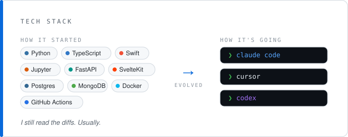

Data scientist and lifelong math nerd, very curious about where AI is taking coding as a profession.

<!--
  Static snapshot cards to keep the design consistent. For LIVE stats instead, swap the stats image for:
  
  
-->
