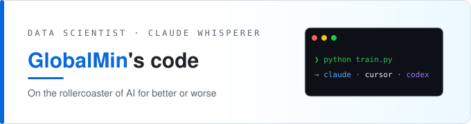
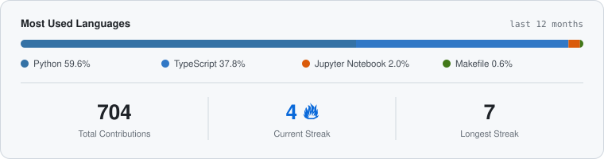

## 

Data scientist and lifelong math nerd, very curious about where AI is taking coding as a profession.

## 💻 Tech Stack

<table align="center">
  <tr>
    <th align="center">HOW IT STARTED</th>
    <th align="center"></th>
    <th align="center">HOW IT'S GOING</th>
  </tr>
  <tr>
    <td align="center" valign="middle" width="380">
         
         
         
      
    </td>
    <td align="center" valign="middle" width="90">
      <h3>➜</h3>
      <b>EVOLVED</b>
    </td>
    <td align="center" valign="middle" width="380">
        
        
      
    </td>
  </tr>
</table>

<em>I still read the diffs. Usually.</em>

## 📊 GitHub Stats

  

<!--
  Static snapshot to match the design exactly. For LIVE stats instead, swap the image above for:
  
  
-->
